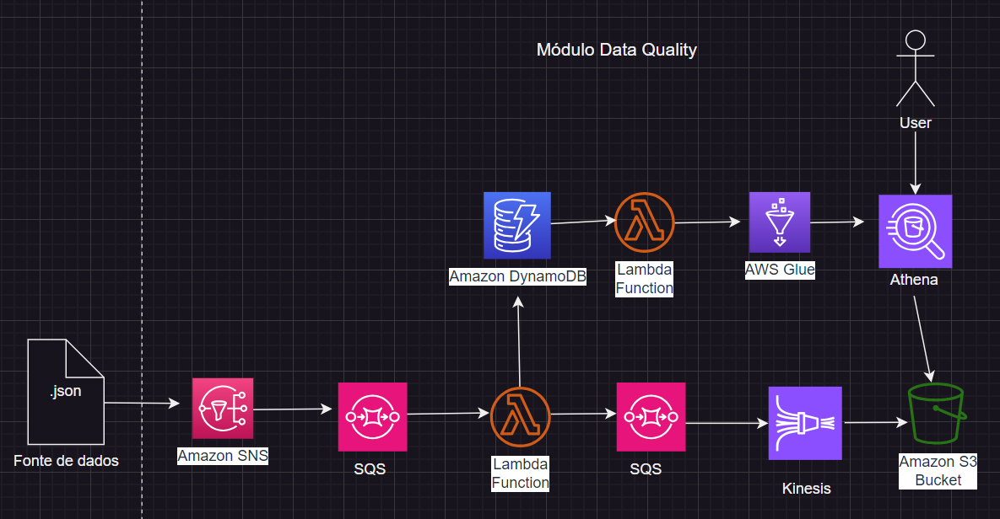

# Documentação do Projeto Data Challenge – Michele Teixeira

## Introdução

Este documento descreve minha jornada ao abordar os exercícios 1, 2 e 3 do Projeto Data Challenge. O foco está na construção de um módulo de Data Quality, automação da criação de tabelas no AWS Athena, e a proposta de uma arquitetura de dados robusta.

### Exercício 1: Módulo de Data Quality

Iniciei o projeto definindo a estrutura básica dentro do diretório `exercicio1/`, concentrando-me em dois arquivos principais: `event_validator.py` e `schema.json`. O `schema.json` serviu como a base para validar a estrutura dos eventos de dados, garantindo sua qualidade.

**Desenvolvimento:**

Implementei a função `validate_event(event, schema)` no arquivo `event_validator.py`. Essa função verifica se cada evento corresponde ao schema definido, atentando especialmente para dois aspectos:

- Asseguro que o tipo de cada campo do evento coincide com o especificado no schema.
- Verifico que o evento não inclua campos não listados no schema.

**Execução:**

Para testar minha implementação, executei `python main.py`, que simula o processo de validação de eventos, assegurando que eles atendam aos critérios definidos.

### Exercício 2: Automação de Criação de Tabelas no AWS Athena

Avancei para o `exercicio2/`, onde meu objetivo era automatizar a criação de tabelas no AWS Athena. Utilizei o mesmo `schema.json` do Exercício 1 como fundamento.

**Desenvolvimento:**

No arquivo `json_schema_to_athena.py`, desenvolvi uma função que traduz o `schema.json` em uma query SQL de criação de tabela para o Athena. Este passo exigiu uma compreensão profunda da documentação do AWS Athena, especialmente no que se refere à sintaxe de criação de tabelas.

**Execução:**

Após implementar a função, executei `python main.py` para testar a automação, verificando se a query SQL gerada estava correta e alinhada com as especificações do Athena.

### Exercício 3: Proposta de Arquitetura de Dados

Finalmente, dediquei-me ao desafio de propor uma arquitetura de dados completa. Meu objetivo era abordar soluções de ingestão, pipeline ETL, soluções de armazenamento, e o catálogo de dados.

**Desenvolvimento:**

Utilizei ferramentas de desenho como Draw.io para esboçar a arquitetura, fazendo escolhas conscientes sobre cada componente:

- **Solução de Ingestão:** Defini como os dados seriam coletados e importados para o sistema.
- **Pipeline ETL:** Projetei o processo de transformação dos dados para prepará-los para análise.
- **Soluções de Armazenamento:** Especifiquei onde os dados seriam armazenados, considerando escalabilidade e acesso.
- **Catálogo de Dados:** Desenvolvi uma estratégia para gerenciar metadados e facilitar a descoberta de dados.

**Documentação:**

Para cada componente da arquitetura, providenciei uma descrição detalhada, explicando sua função e contribuição para os objetivos gerais de negócios e dados.

## Considerações Finais

Espero que este documento ofereça uma visão clara da minha abordagem aos desafios propostos, refletindo as decisões, implementações e aprendizados ao longo deste projeto.

---

# ARQUITETURA DO PROJETO – Módulo Data Quality

Arquitetura construída utilizando serviços AWS, proporcionando um sistema altamente disponível, escalável e com baixa latência para o processamento de eventos de dados críticos para o negócio. 
Essa arquitetura do Módulo Data Quality foi projetada para garantir a validação eficiente de eventos de dados e fornecer uma plataforma robusta para análise de dados. 
Abaixo está a descrição detalhada de cada componente e seu papel no pipeline de dados.

## 1. Fonte de Dados (.json)
- **Descrição**: Eventos de dados gerados em formato JSON.

## 2. Amazon SNS
- **Descrição**: Distribuição de eventos de dados para múltiplos assinantes.

## 3. Amazon SQS
- **Descrição**: Enfileiramento seguro e confiável de eventos de dados.

## 4. AWS Lambda (Função de Validação de Dados)
- **Descrição**: Validação dos dados conforme um esquema JSON definido.

## 5. Amazon DynamoDB
- **Descrição**: Armazenamento de dados validados para acesso e consulta rápidos.

## 6. AWS Glue
- **Descrição**: Gerenciamento de metadados e preparação de dados para análise.

## 7. Amazon Athena
- **Descrição**: Execução de consultas SQL diretamente sobre os dados armazenados no Amazon S3.

## 8. Usuário Final
- **Descrição**: Interação com insights e análises de dados através do Athena.

## 9. Amazon S3 Bucket
- **Descrição**: Armazenamento de dados brutos ou data lake.

## 10. Amazon Kinesis
- **Descrição**: Capacidade de processar dados em streaming para suportar análises em tempo real e batch.

